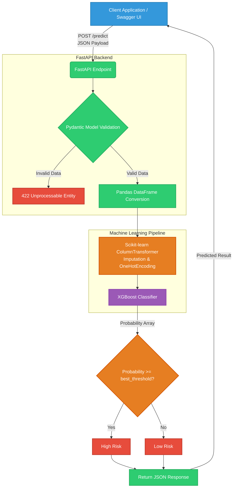

# Credit Risk Assessment ML Pipeline & API

This project contains an end-to-end Machine Learning pipeline for predicting credit risk (loan defaults) and a FastAPI backend to serve the model in production. 

## 📌 Project Overview

The core objective is to evaluate loan applications and predict the likelihood of default based on historical data. The solution is split into two parts:
1. **Model Training & Evaluation (`credit Risk.ipynb`)**: An exhaustive Jupyter Notebook covering Exploratory Data Analysis (EDA), missing value imputation, categorical encoding, baseline model building (Logistic Regression), advanced modeling (XGBoost), hyperparameter tuning via `RandomizedSearchCV`, threshold optimization using the Precision-Recall curve, probability calibration, and SHAP interpretability.
2. **Model Serving (`main.py`)**: A high-performance asynchronous REST API built with FastAPI that exposes a `/predict` endpoint. It uses Pydantic for data validation and loads the saved XGBoost model (`credit_risk_model.pkl`) and optimized threshold (`best_threshold.pkl`) directly into memory on startup.

---

## 🏗️ Structure Flow Chart



---

## 🚀 Features

- **XGBoost Pipeline**: A robust `scikit-learn` Pipeline combining `ColumnTransformer` (SimpleImputers, OneHotEncoders) directly with the `XGBClassifier` estimator.
- **Threshold Optimization**: Instead of the default `0.5` classification threshold, we optimize for the F1 score using a precision-recall curve to perfectly balance precision and recall on our imbalanced dataset.
- **FastAPI Backend**: Lifespan context manager ensures that the `.pkl` models are loaded into memory *only once* when the server starts up, improving latency per request. 
- **CORS Enabled**: Cross-Origin Resource Sharing is enabled, meaning this API can be consumed natively from any web frontend or external application.

---

## 🛠️ API Schema (`/predict`)

Send a `POST` request to `/predict` with the following JSON body:

```json
{
  "person_age": 35,
  "person_income": 65000.0,
  "person_home_ownership": "RENT",
  "person_emp_length": 5.0,
  "loan_intent": "EDUCATION",
  "loan_grade": "B",
  "loan_amnt": 15000,
  "loan_int_rate": 11.5,
  "loan_percent_income": 0.23,
  "cb_person_default_on_file": "N",
  "cb_person_cred_hist_length": 6
}
```

**Expected Response**:
```json
{
  "Default Probability": 0.324519,
  "Default Prediction": 1,
  "Threshold": 0.2854,
  "Result": "High Risk"
}
```

---

## 💻 Running the Application Locally

1. **Install Dependencies**: Make sure you have the required packages installed (`fastapi`, `uvicorn`, `pydantic`, `pandas`, `xgboost`, `scikit-learn`, `joblib`).
2. **Start the Server**:
   ```bash
   uvicorn main:app --reload
   ```
3. **Interactive API Docs**: Navigate to `http://127.0.0.1:8000/docs` in your browser to automatically view and test the API using Swagger UI.
